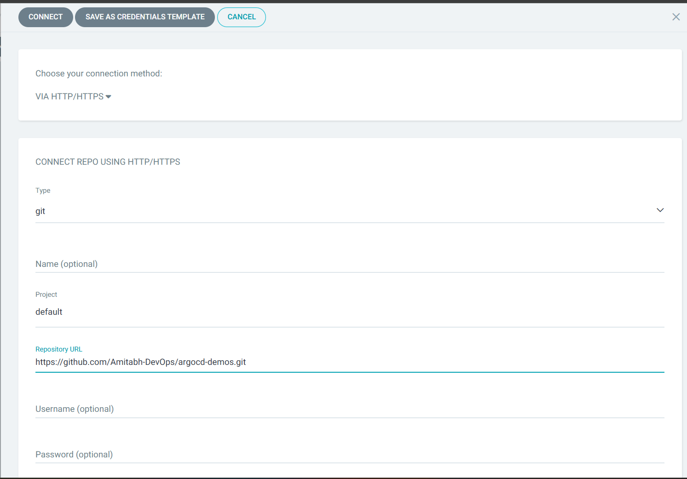
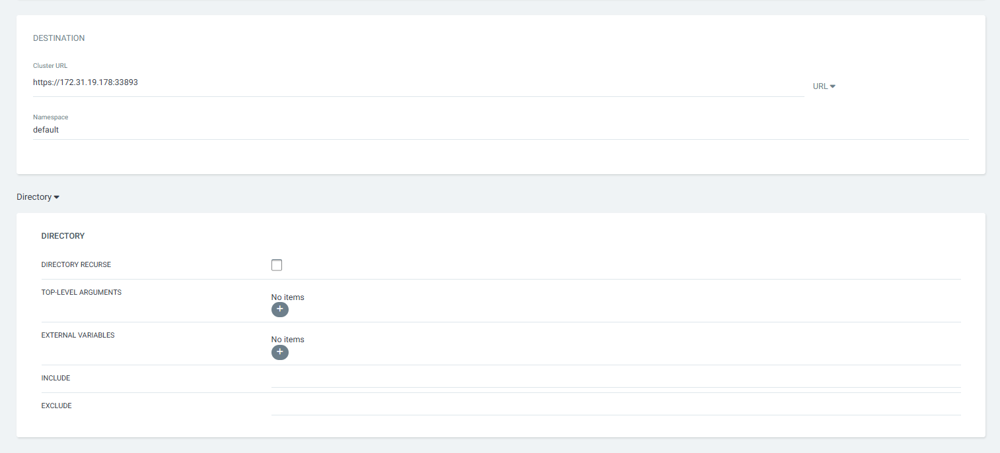
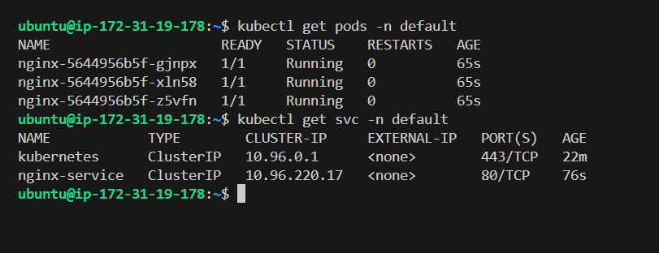
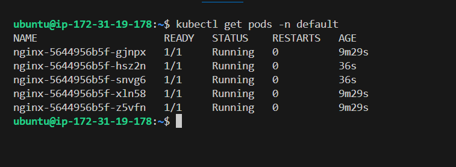
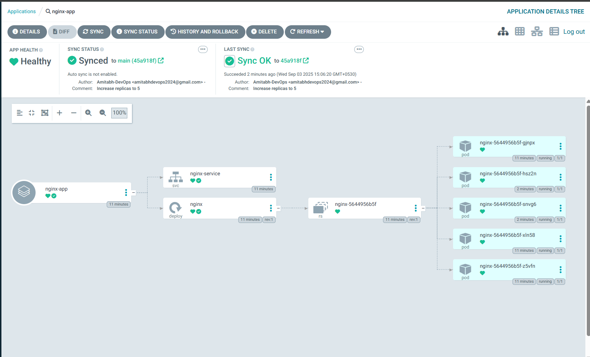

# UI Approach with ArgoCD (NGINX Example)

In this approach, we will deploy an application using **ArgoCD UI** (imperative way).  
We’ll use a simple **NGINX Deployment + Service** to understand how ArgoCD manages GitOps from the UI.

---

## Theory

- In the **UI approach**, we create applications directly from the ArgoCD dashboard.  
- This means ArgoCD generates the `Application` resource (CRD) inside the cluster for us.  
- The app definition lives **only in the cluster**, not in Git.  
- It’s quick and great for demos, but **not true GitOps** (since configs are not version-controlled).  

> ✅ Best practice: Use the **Declarative approach (CRDs in Git)** for production.  
> ❌ The UI method is best suited for learning and testing.  

---

## Prerequisites

Before you begin, ensure you have:  
1. A **Kind cluster** running  
2. **ArgoCD installed & running** (via Helm or manifests)
3. ArgoCD CLI Installed and logged In  
4. `kubectl` installed to interact with your cluster

> Follow this to get above things done: [ArgoCD Setup & Installation](../../../03_setup_installation/README.md)

---

## Steps to Deploy NGINX using ArgoCD UI

### 1. Open a new VSCode editor & Open that `argocd-demos` repo that you had clonned

Just for manifest files, or making changes or pushing it to git - used while testing all approaches.

In below directory you can see the related manifest files:

    ```bash
    cd argocd-demos/ui_approach/nginx
    ```

---

### 📂 Directory Structure

```

ui_approach/nginx
├── nginx_deployment.yml
└── nginx_svc.yml

```

---

### 2. Access ArgoCD UI

Port-forward ArgoCD server:

```bash
kubectl port-forward svc/argocd-server -n argocd 8080:443 --address=0.0.0.0 &
```

Open the UI: **[http://<instance_public_ip>:8080](http://<instance_public_ip>:8080)**
Login with:

* Username: `admin`
* Password: (fetched from secret: `kubectl -n argocd get secret argocd-initial-admin-secret -o jsonpath="{.data.password}" | base64 -d`)

---

### 3. Connect your Git Repository

1. In ArgoCD UI, go to **Settings → Repositories**.
2. Click **Connect Repo**.
3. Choose your connection method:
    * **HTTPS** (for public/private repos)
4. Fill in your Git repo details 
    * **Project**: default
    * **Repository URL**: `<add_url_of_forked_repo_of_argocd_demos>`
    * **Username/Password**: (if private repo)
5. Click **Connect**.



You should see your repo listed under **Connected Repositories**.

    
    

### 4. Adding Cluster to ArgoCD server

1. Check your config contexts:

```bash
kubectl config get-contexts
```

Identify your cluster context (e.g., `kind-argocd-cluster`).

2. Add the cluster to ArgoCD:

```bash
argocd cluster add kind-argocd-cluster --name argocd-cluster --insecure
```

3. Verify using:

```bash
argocd cluster list
```

> Note: Initially the status of cluster you will get "Unknown", no worry - it will become successful after deploying your first application on ArgoCD Server.

> something like this you will get after your first app deployment, if you run `argocd cluster list`:

```
SERVER                          NAME            VERSION  STATUS      MESSAGE                                                  PROJECT
https://172.31.19.178:33893     argocd-cluster  1.33     Successful
https://kubernetes.default.svc  in-cluster               Unknown     Cluster has no applications and is not being monitored. 
```

You should see something like this in ArgoCD Server: **Settings → Clusters**.
    

    

---

### 5. Create Application in ArgoCD UI

1. In ArgoCD UI, Go to **Applications** and click **New App**.
2. Fill the fields:

   * **App Name**: `nginx-app`
   * **Project**: `default`
   * **Repository URL**: `<select_the_connected_repo>` 
   * **Revision**: `main`
   * **Path**: `ui_approach/nginx`
   * **Cluster**: `<select_added_cluster_url>`
   * **Namespace**: `default`

    

    

3. Leave Sync Policy as **Manual** for now.
4. Click **Create**.

---

### 6. Sync the Application

* The app will show as **OutOfSync**.
* Click **Sync → Synchronize**.
* ArgoCD will apply `nginx_deployment.yml` and `nginx_svc.yml` into the `default` namespace.

    

* After syncing, the status should change to **Synced** and **Healthy**.

    

---

### 7. Verify the Deployment

From CLI:

```bash
kubectl get pods -n default
kubectl get svc -n default
```

You should see:

* NGINX pods running (`nginx-deployment-xxxx`).
* `nginx-service` of type ClusterIP exposing port 80.

Something like this:



---

### 8. Access Nginx via browser

1. Port-forward the NGINX service:

```bash
kubectl port-forward svc/nginx-service 8081:80 --address=0.0.0.0 &
```

2. Open the inbound rule for port 8081 on your EC2 instance

3. Access the Nginx app at:

```bash
http://<EC2-Public-IP>:8081
```

You should see the default NGINX welcome page.


---

## Testing

### Make a Change in Git

1. Open `nginx_deployment.yml` in your local repo.
2. Change the replicas from 3 to 5

```yaml
spec:
  replicas: 5  # Change this from 3 to 5
``` 

3. Commit and push the change to GitHub:

```bash
git add nginx_deployment.yml
git commit -m "Increase replicas to 5"
git push origin main
```

### Observe ArgoCD UI

1. Go to ArgoCD UI, select `nginx-app`.
2. You should see the app is **OutOfSync** again.
3. Click **Sync → Synchronize** to apply the changes.
4. After syncing, the status should change to **Synced** and **Healthy**.
5. Verify the change:

```bash
kubectl get pods -n default
```

You should see 5 NGINX pods running now.



In your ArgoCD, in `nginx-app` you can see that pods are created from 3 to 5:



---

## Destroy 

For complete destroy, you can directly delete the cluster by using below command:

```bash
kind delete cluster --name argocd-cluster
```

---

## Wrap-Up

* You successfully deployed an app via **ArgoCD UI**.
* Key takeaway:

  * UI is **imperative** → fast for demos.
  * Real GitOps requires **declarative Application CRDs in Git** (covered in later approaches).


Happy Learning!