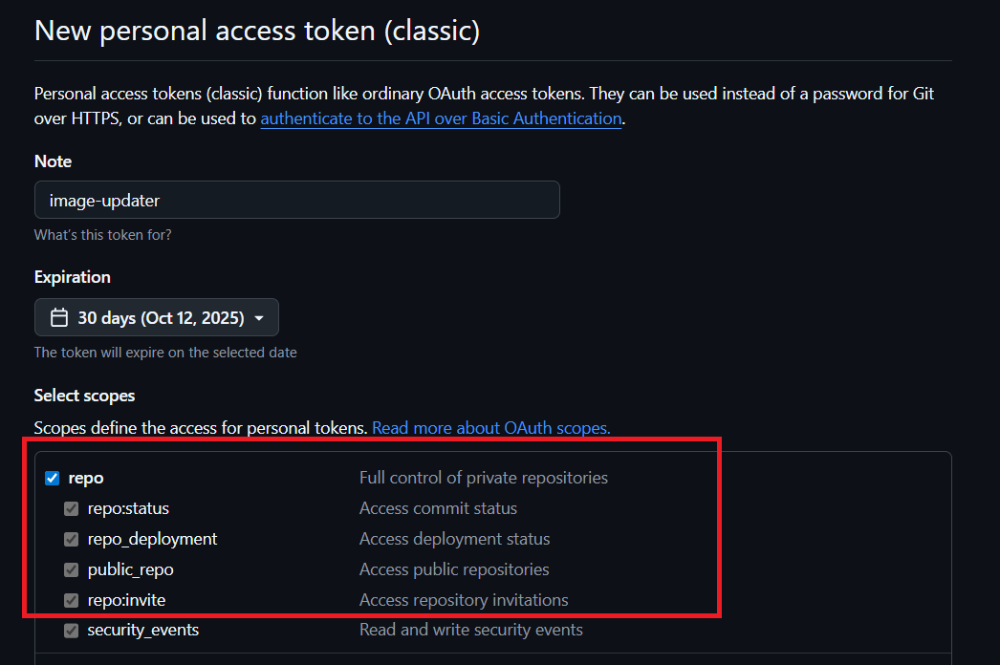
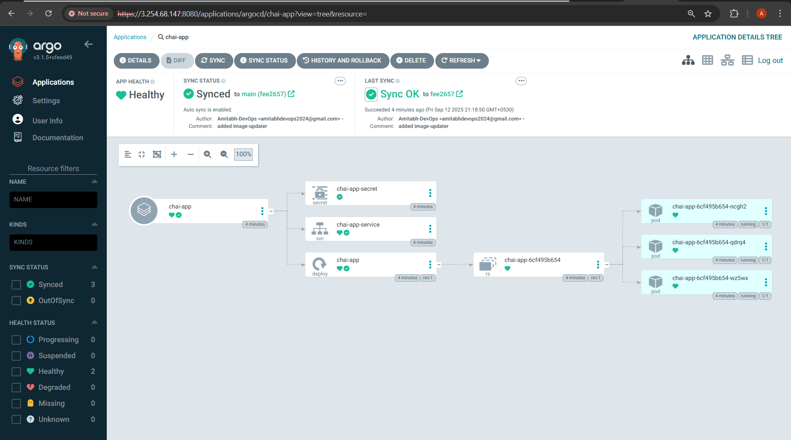
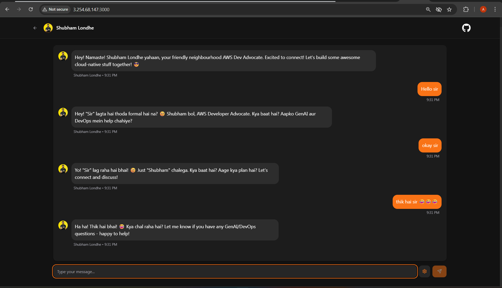
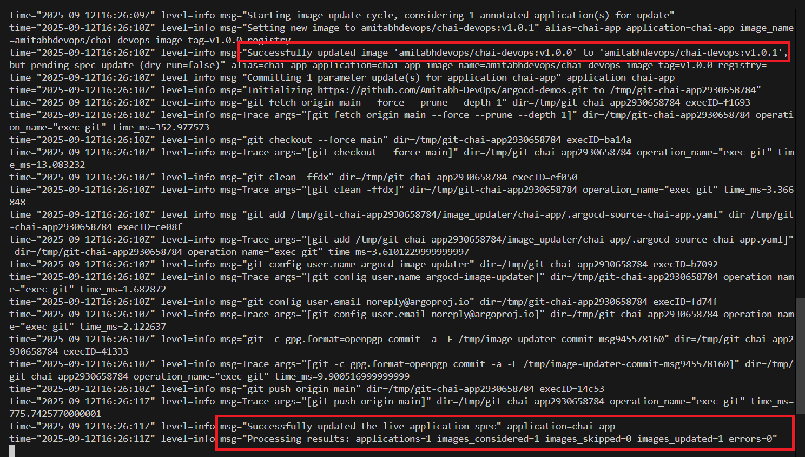
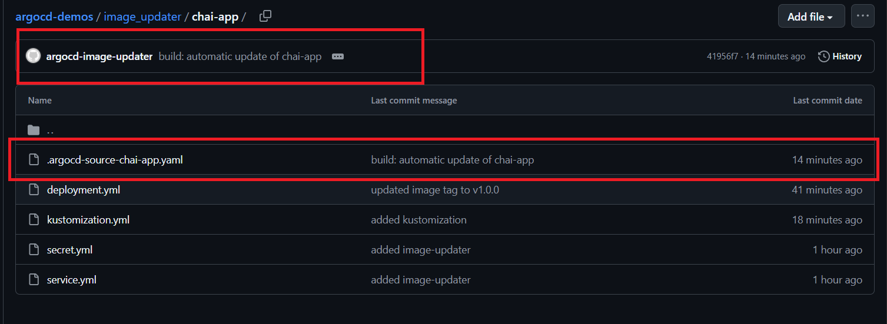
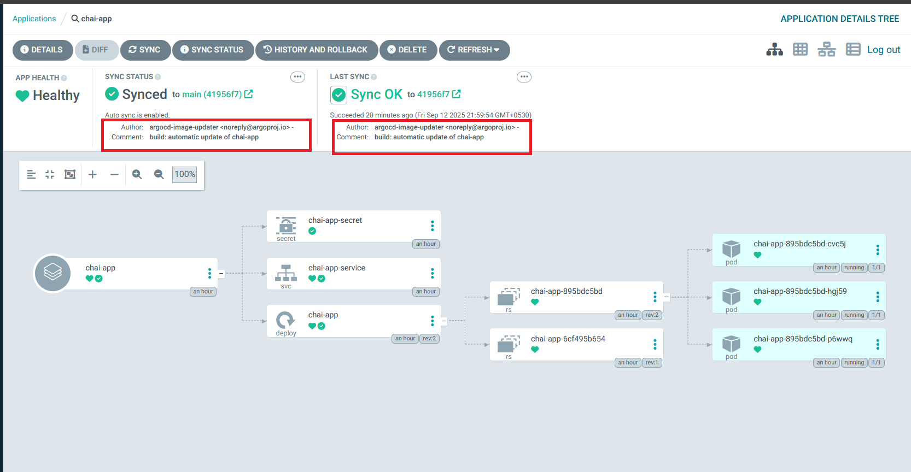
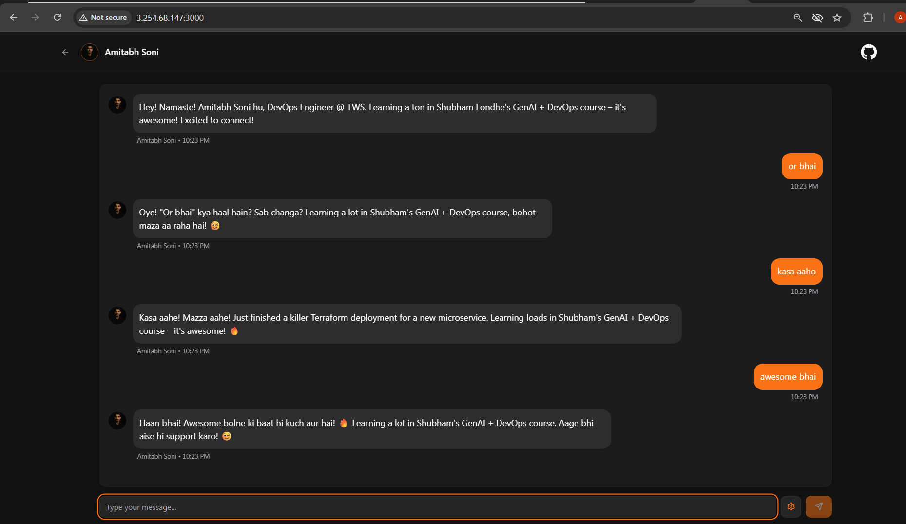
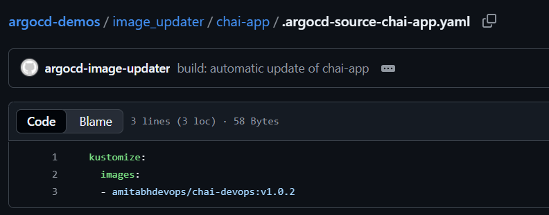

# Chapter 7 — Argo CD Image Updater

Argo CD Image Updater automates updating container images in ArgoCD-managed Applications. Instead of manually editing manifests every time a new image tag is pushed, Image Updater detects new versions and either updates your Git repository (recommended) or the ArgoCD Application directly.

---

## 1. Why use Argo CD Image Updater?

* Saves manual effort: no more editing YAML for new image tags.
* Keeps applications updated with the latest images (patches, fixes).
* Maintains Git as the single source of truth (when using **git** write-back).
* Works alongside ArgoCD for a full GitOps workflow.

---

## 2. Key concepts explained 

### **Write-back mode**

When Image Updater finds a new image, it has two ways to “write back” the update:

* **git write-back** → creates a commit in your Git repo, updating the image tag in the manifests. ✅ Best practice for GitOps, because Git remains the source of truth.
* **argocd write-back** → directly changes the ArgoCD Application resource in the cluster (imperative). Faster, but changes are not recorded in Git.

👉 For our demo, we’ll use **git write-back**.

---

### **Semantic Versioning (semver)**

* **semver** stands for **Semantic Versioning**, a way of numbering versions like `1.0.0`, `1.0.1`, `1.1.0`, `2.0.0`.
* Format: **MAJOR.MINOR.PATCH**

  * `MAJOR` → breaking changes (e.g., 1.x.x → 2.0.0)
  * `MINOR` → new features (e.g., 1.1.0 → 1.2.0)
  * `PATCH` → bug fixes (e.g., 1.1.1 → 1.1.2)

If you set strategy to **semver**, Image Updater only upgrades within semver rules (e.g., from 1.0.0 → 1.0.1 or 1.1.0, but not to 2.0.0).

The following update strategies are currently supported:

* semver - Update to the latest version of an image considering semantic versioning constraints
* latest/newest-build - Update to the most recently built image found in a registry
* digest - Update to the latest version of a given version (tag), using the tag's SHA digest
* name/alphabetical - Sorts tags alphabetically and update to the one with the highest cardinality

👉 For safety, we’ll use **semver**.

---

### **Image alias**

Official docs recommend assigning an **alias** for each image. Example:

```yaml
argocd-image-updater.argoproj.io/image-list: myalias=some/image
```

* An alias is a symbolic name you assign to an image.
* Aliases can be any alphanumeric string (avoid special chars, except `/` which must be written as `_` in annotations).
* The alias is then reused in other annotations, e.g.:

  ```yaml
  argocd-image-updater.argoproj.io/myalias.update-strategy: semver
  ```

* Why aliases?

  1. They are required if using Helm charts with custom parameter names.
  2. They allow different options per image (e.g., strategies, pull secrets).
  3. They make configs cleaner when you track multiple images.

👉 In simple cases, you can set alias = container name. For your chai-app:

```yaml
containers:
- name: chai-app
  image: <your-dockerhub-username>/chai-devops:latest
```

Annotation:

```yaml
argocd-image-updater.argoproj.io/image-list: chai-app=<your-dockerhub-username>/chai-devops
```

---

## 3. Prerequisites

* Kind cluster running.
* ArgoCD Server installed & running.
* `kubectl` installed & configured.
* ArgoCD CLI installed and logged In.
* A GitHub repo with your manifests (example: `https://github.com/Amitabh-DevOps/argocd-demos.git`).
* GitHub Personal Access Token (PAT) with `repo` permissions (for git write-back).
    
    
    
* Docker Hub account to push your own copy of the demo image.

> Setup ArgoCD and kind Cluster using: [ArgoCD & Cluster](../03_setup_installation/README.md)

---

## 4. Install Argo CD Image Updater

Install into the `argocd` namespace:

```bash
kubectl apply -n argocd -f https://raw.githubusercontent.com/argoproj-labs/argocd-image-updater/stable/manifests/install.yaml
```

Verify pod is running:

```bash
kubectl -n argocd get pods -l app.kubernetes.io/name=argocd-image-updater
```


---

## 5. Prepare your Docker Hub image

Instead of using my image directly, you will **pull it and re-push it to your own Docker Hub account**.

1. Log in to Docker Hub with your `username` and `DockerHub PAT`:

   ```bash
   docker login
   ```

2. Pull my base image:

   ```bash
   docker pull amitabhdevops/chai-devops:latest
   ```

3. Tag it with your own Docker Hub username:

   ```bash
   docker tag amitabhdevops/chai-devops:latest <your-dockerhub-username>/chai-devops:v1.0.0
   ```

4. Push it to your account:

   ```bash
   docker push <your-dockerhub-username>/chai-devops:v1.0.0
   ```

Now you own a copy of the demo image and can push new versions under your account.

> [!IMPORTANT]
>
> Update image in your `deployment` of chai-app:
> 
> 1. Open that forked & clonned repo of this repo `https://github.com/Amitabh-DevOps/argocd-demos.git`.
> 2. Navigate to `image_updater/chai-app/deployment.yml`.
> 3. Update image from `amitabhdevops/chai-devops:v1.0.0` to `<your-dockerhub-username>/chai-devops:v1.0.0`. Here:
>
>     
>
> 4. Commit and push the change to your GitHub repo.


---

## 6. Configure Git credentials (for git write-back)

Create a secret with GitHub username and PAT:

**File: `secret-image-updater-git.yaml`**

Use: [secret-image-updater-git.yaml](secret-image-updater-git.yaml)

> Replace `<github-username>` with your GitHub Username.

> Replace `<personal-access-token>` with your GitHub Personal Access Token (PAT)

Apply it:

```bash
kubectl apply -f secret-image-updater-git.yaml
```

> ⚠️ Do not commit real secrets to Git. Use sealed-secrets or vault in production.

---

## 7. Annotate your Application (chai-app)

Update your `chai-app` Application with annotations to track your **own Docker Hub image**:

**File: `chai-app.yaml`**

Use: [chai-app.yaml](chai-app.yaml)

> Replace `<your-dockerhub-username>` with your Docker Hub username.

> Replace `<your-github-username>` with Your GitHub username, the repo which your forked and clonned - `argocd-demos`.

Apply it:

```bash
kubectl apply -f chai-app.yaml
```

Verfy `chai-app` in ArgoCD Server:

* chai-app:

    

* chai-app details:

    

* Port-forward the `chai-app-service` and access that `http://<instance_public_ip>:3000`:

    ```bash
    kubectl port-forward svc/chai-app-service 3000:3000 --address=0.0.0.0 &
    ```

    

    

    

---

## 8. Demo: Auto-update flow

1. Push a new image tag to your Docker Hub:

   ```bash
   docker tag amitabhdevops/chai-devops:v1.0.2 amitabhdevops/chai-devops:v1.0.3
   docker push amitabhdevops/chai-devops:v1.0.3
   ```

2. Wait for Image Updater to poll. Tail logs:

   ```bash
   kubectl -n argocd logs deploy/argocd-image-updater -f
   ```

3. You should see logs like `found newer image tag` and `creating git commit`.

    

4. Check your Git repo - you should see a commit updating the manifest from v1.0.0 → v1.0.1.
     
     * You can see that `argocd-image-updater` created new yaml file:

        

     * that contains new image with new tag `v1.0.1`:

        

5. ArgoCD detects the commit and syncs:
    
    * You can check your application deployment in ArgoCD server, that image is updated in deployment:

        

        

        

6. And similarly, in future you update image tag then it will replce `v1.0.1` with new one like below:

    

    

---

## 10. Troubleshooting

* **No updates?** Ensure `image-list` alias matches what you used in annotations (`chai-app`).
* **Git errors?** Ensure PAT has correct repo permissions.
* **Private registry?** Add registry credentials secret.
* **Wrong versions?** Use `semver` instead of `latest` for controlled upgrades.

---

## 11. Key takeaways

* Image Updater automates updating your **chai-app** image from Docker Hub.
* You will **re-publish my demo image under your own account** to practice pushing new versions.
* **Write-back mode** decides *where* the update is written (Git vs ArgoCD).
* **Semver strategy** ensures safe, controlled upgrades.
* **Aliases** are symbolic names for images.
* Prefer versioned tags (`:v1.0.1`) over `:latest`.

---

Now the flow is real-world: pull my base image → re-publish under your account → push a new version → Image Updater commits → ArgoCD syncs → cluster updated automatically.

Read More: [ArgoCD Image Updater](https://argocd-image-updater.readthedocs.io/en/stable/)

---

Happy Learning