# Chapter 8: Monitoring ArgoCD

In this chapter, we’ll learn how to **monitor ArgoCD** using **Prometheus, Grafana**. Monitoring gives us visibility into application health, sync performance, and audit trails.

We will monitor two running ArgoCD Applications:

* **online-shop** (declarative demo app)
* **chai-app** (our sample app with notifications)

---

## 1. Why Monitoring Matters

Think of monitoring like a **doctor’s check-up for your apps**:

* **Metrics** → heartbeat, blood pressure (numbers that tell you how ArgoCD is doing)
* **Dashboards** → health reports (visual panels that make it easy to spot problems)

---

## 2. Key Metrics to Watch (Top 5)

ArgoCD exports many Prometheus metrics, but as beginners, focus on these:

1. **Sync status** → `argocd_app_sync_total`

   * Shows how many syncs succeeded/failed.
   * Example: failed syncs of `chai-app`.

2. **Health status** → `argocd_app_info`

   * Tracks if apps are `Healthy`, `Degraded`, or `Missing`.
   * Example: `online-shop` turns Degraded if pods crash.

3. **Reconcile time** → `argocd_app_reconcile`

   * How long ArgoCD takes to compare Git vs cluster.

4. **Git fetch failures** → `argocd_git_fetch_fail_total`

   * Helps debug repo issues (e.g., wrong URL or creds).

5. **API logins** → `argocd_login_request_total`

   * Useful to track user/API activity.

---

## Prerequisites

- Kubernetes cluster (kind, minikube, etc.)
- ArgoCD Server installed & running
- ArgoCD CLI Installed & Logged in
- kubectl configured    
- Helm 3.x installed

> [!IMPORTANT]
> 
> Run this [setup_argocd.sh](../03_setup_installation/setup_argocd.sh) or follow README, but choose `Manifests` installation method for ArgoCD, because the `metrics` services of ArgoCD will be created by only official manifests, not with helm. That is requried in monitoring ArgoCD Stuff.

---

# Hands-On: Monitor ArgoCD with Prometheus & Grafana

## Architecture Overview

```
┌─────────────────┐    ┌──────────────────┐    ┌─────────────────┐
│   ArgoCD Apps   │───▶│   ArgoCD Metrics │───▶│   Prometheus    │
│ (chai-app,      │    │ Endpoints :      │    │   Scrapes       │
│  online-shop)   │    │ 8082, 8083, 8084 │    │   Metrics       │
└─────────────────┘    └──────────────────┘    └─────────────────┘
                                                         │
                                               ┌─────────────────┐
                                               │    Grafana      │
                                               │ Dashboards      │
                                               │ IDs: 14584,19993│
                                               └─────────────────┘
```

## Step 1: Verify Metrics Endpoints

Run:
```bash
kubectl get svc -n argocd
```

You should see services like `argocd-metrics`, `argocd-server-metrics`, `argocd-repo-server`.

ArgoCD exposes metrics by default, if you installed ArgoCD with Manifests method:

- **Application Controller:** svc/argocd-metrics → 8082/metrics
- **API Server:** svc/argocd-server-metrics → 8083/metrics
- **Repo Server:** svc/argocd-repo-server → 8084/metrics


---

## Step 2: Install Prometheus & Grafana

```bash
helm repo add prometheus-community https://prometheus-community.github.io/helm-charts
kubectl create namespace monitoring
helm install kube-prometheus-stack prometheus-community/kube-prometheus-stack -n monitoring
```

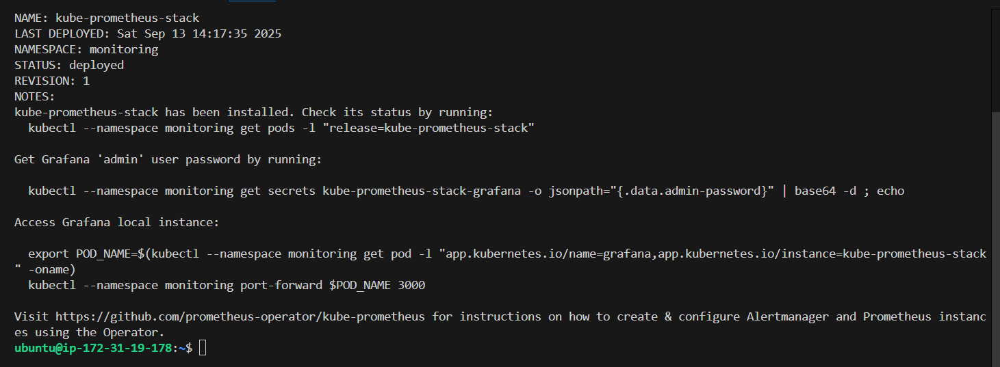

---

## Step 3: Create ServiceMonitors
We need to tell Prometheus to scrape ArgoCD metrics endpoints. We do this by creating `ServiceMonitor` resources.

Create using: [argocd-service-monitors.yaml](argocd-service-monitors.yaml)

```bash
kubectl apply -f argocd-service-monitors.yaml
```


---

## Step 4: Deploy `chai-app` and `online-shop` Apps

Create: [chai-app.yaml](chai-app.yaml)

Apply: 

```bash
kubectl apply -f chai-app.yaml
```

Then create: [online-shop-app.yaml](online-shop-app.yaml)

Apply:

```bash
kubectl apply -f online-shop-app.yaml
```

> [!NOTE]
>
> Replace `<your-username>` with your GitHub username in both Application CRD, where you have forked & clonned the repo: `argocd-demos`.

* ArgoCD Application Dashboard:
    
    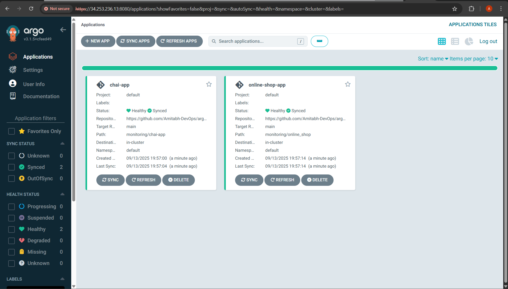


* `chai-app`:

    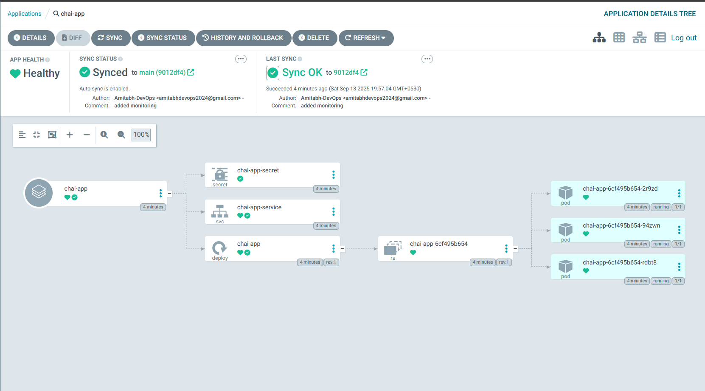

    


* `online-shop`:

    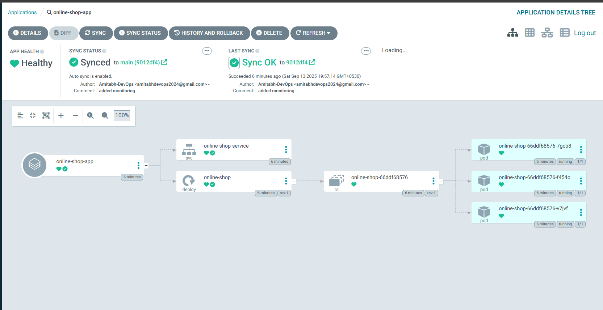

    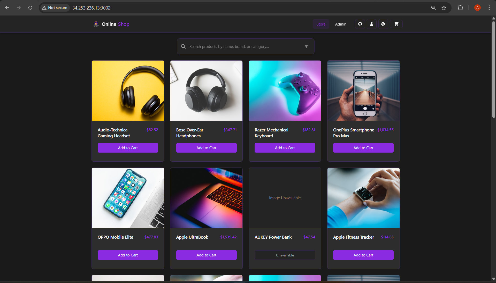


---

## Step 5: Access Grafana & Import Dashboards

```bash
kubectl port-forward svc/kube-prometheus-stack-grafana -n monitoring 3000:80 --address=0.0.0.0 &
# Login: admin/prom-operator
```

* Grafana Login:

    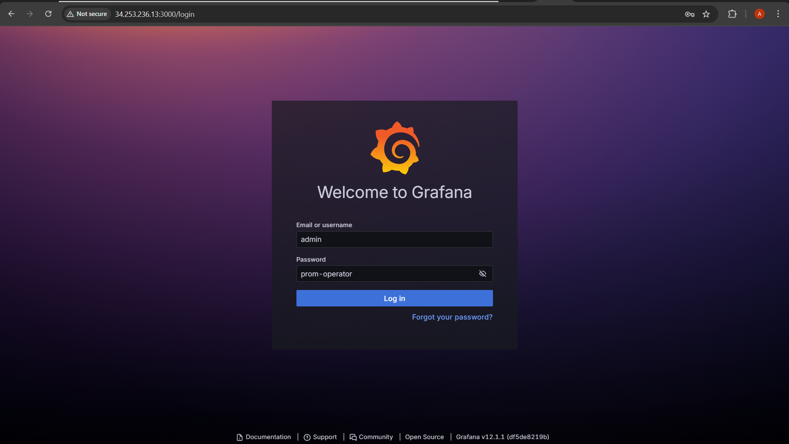

* Grafana Home:

    

* Grafana Pre-Added Datasource (You can see `Prometheus is already added`):

    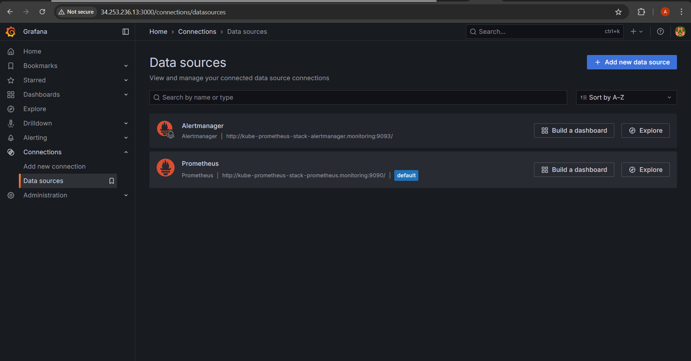


### Import Dashboards

1. **ArgoCD Overview** (ID: **14584**): Sync & Health metrics
    
    

    Similarly, You can scroll down and see all ArgoCD Data.

2. **ArgoCD Operational Overview** (ID: **19993**): Detailed operational metrics

    * Summary & Sync Stats:

        

    * Repo Server Stats:

        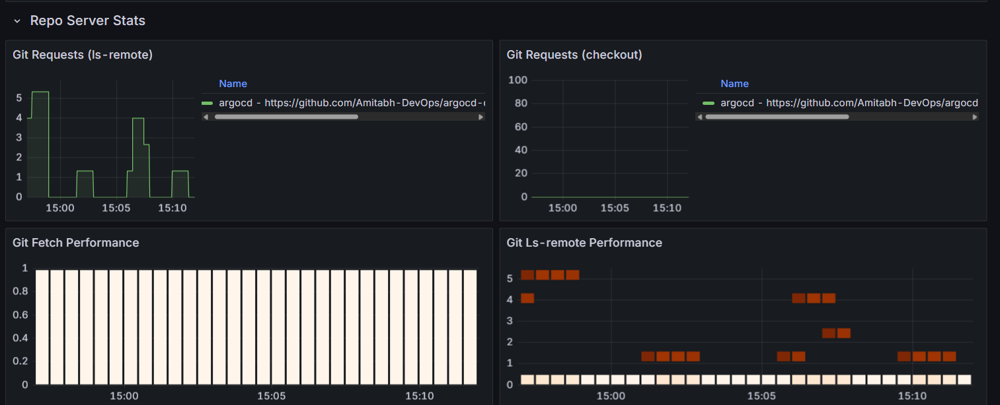

    Similary, You can observe all of your ArgoCD & Cluster Data

---

## Step 6: Access Prometheus Dashboard

Forward Prometheus Service & Opent the inbound rule for port `9090` and access it in browser:

```bash
kubectl port-forward svc/kube-prometheus-stack-prometheus -n monitoring 9090:9090 --address=0.0.0.0 &
```

* Prometheus UI:

    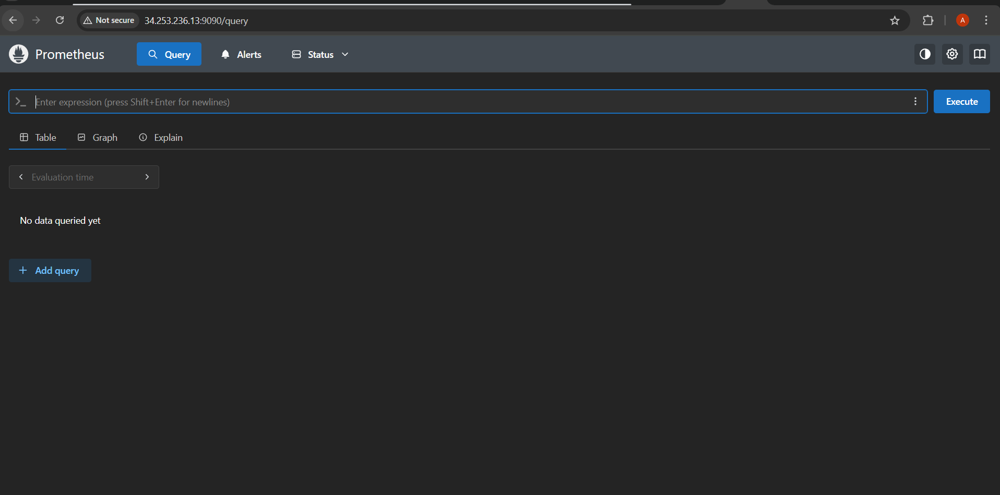

---

## Step 7: Example Queries (Beginner-Friendly)

### Prometheus (PromQL)

Here are some beginner-friendly PromQL queries to monitor ArgoCD:

- **Get All ArgoCD Applications Info**

    Shows application sync status, health status, and labels:

    ```promql
    argocd_app_info
    ```

    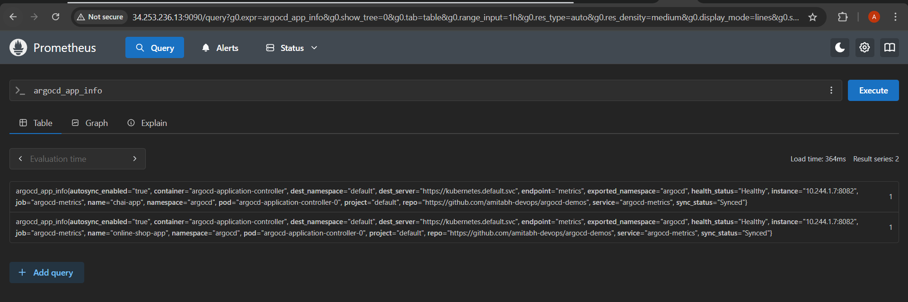


- **Count Applications by Health Status**
    
    Grouping apps by their health condition:

    ```promql
    count by (health_status) (argocd_app_info)
    ```

    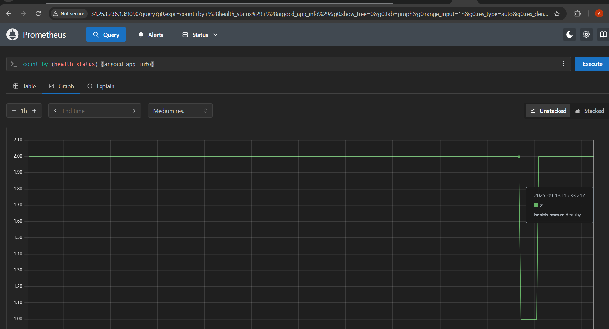


- **Count Applications by Sync Status**

    Grouping apps by sync status (Synced, OutOfSync, etc.):

    ```promql
    count by (sync_status) (argocd_app_info)
    ```

    

- **Application Sync Success / Failure Counts**
    
    Number of syncs per application, broken down by phase:

    ```promql
    sum by (name, phase) (increase(argocd_app_sync_total[5m]))
    ```

    

- **Sync Failures for chai-app:** 
  ```promql
  increase(argocd_app_sync_total{phase="Failed",name="chai-app"}[5m])
  ```

- **Healthy Applications Count:**
  ```promql
  count(argocd_app_info{health_status="Healthy"})
  ```
  
    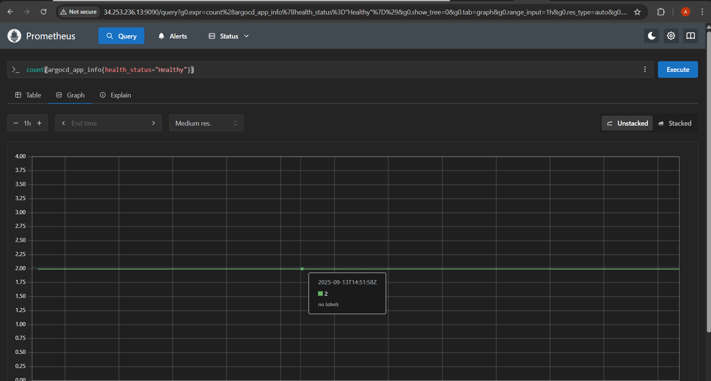

- **Git Fetch Failures:**
  ```promql
  increase(argocd_git_fetch_fail_total[5m])
  ```

---

## Concepts & Explanations

- **Metrics vs Logs vs Alerts:** Metrics are numeric time-series; logs are event records; alerts trigger on metrics thresholds.
- **ServiceMonitor:** CRD that tells Prometheus which Kubernetes services to scrape.
- **PromQL:** Prometheus Query Language to aggregate and filter metrics.
- **Grafana Dashboard:** Visual panels built using PromQL to display metrics over time.

*Enjoy comprehensive, production-ready monitoring for your ArgoCD GitOps workflow!*

Read More: [ArgoCD Metric](https://argo-cd.readthedocs.io/en/latest/operator-manual/metrics/)

---

Happy Learning!