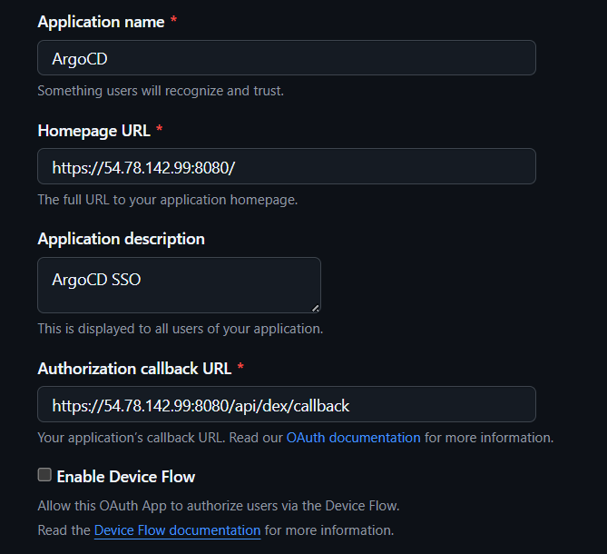
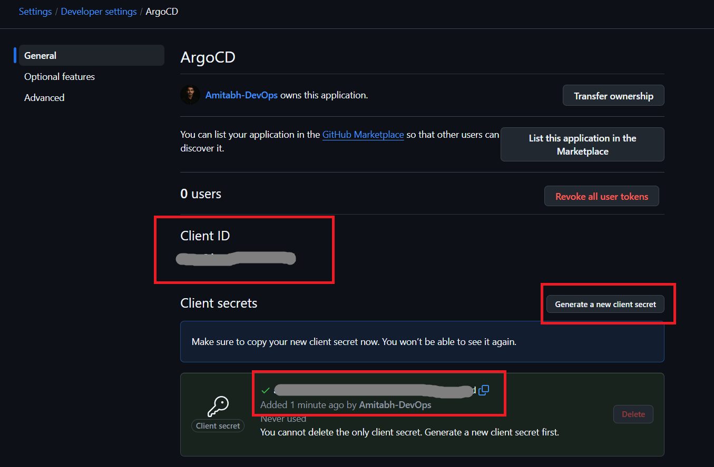
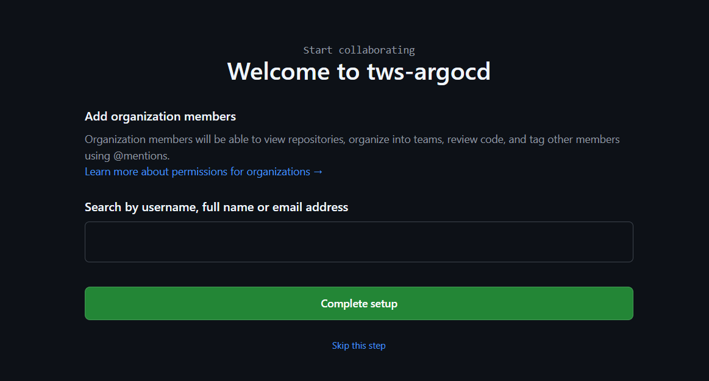
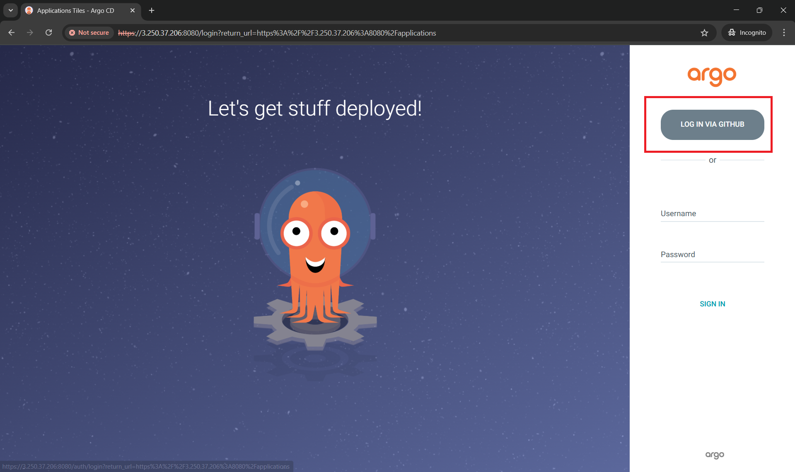
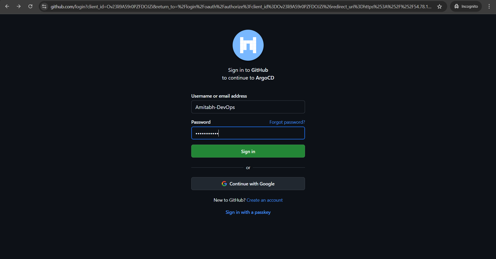
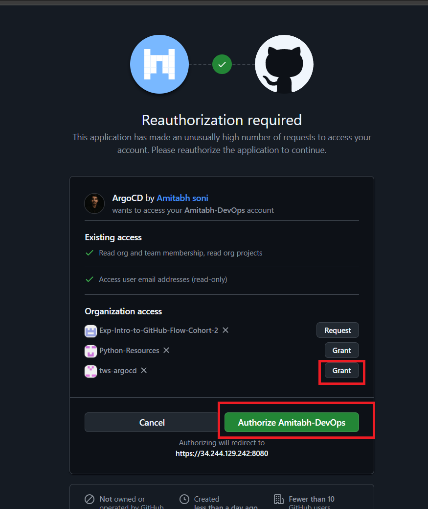
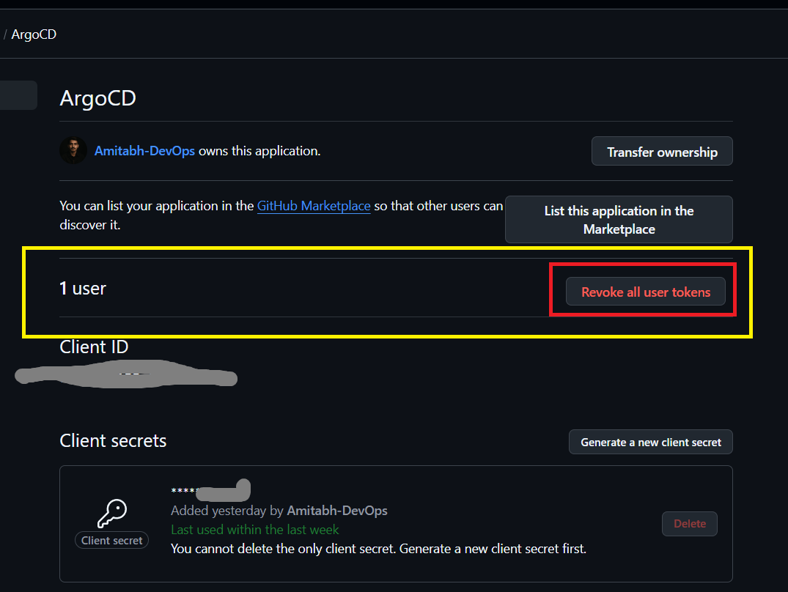
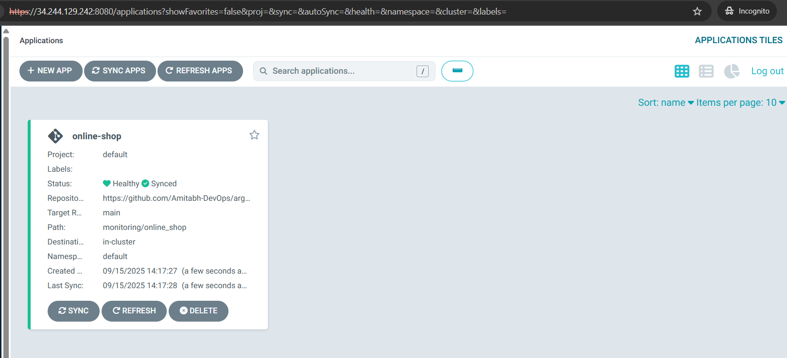

## 3. SSO with Dex / OIDC

### Why SSO?

- **Centralized authentication** using corporate accounts
- **No separate credentials** to manage
- **Better security** and compliance
- **Group-based access** control

### SSO Options in ArgoCD

1. **Bundled Dex** - For providers that don't support OIDC (SAML, LDAP) or need Dex features
2. **Existing OIDC Provider** - Direct integration with Okta, Auth0, Google, etc.

---

### GitHub SSO with Dex

Dex is a built-in OIDC identity service bundled with ArgoCD, used when you want to connect to external identity providers (GitHub, Google, LDAP, SAML).

**Step 1: Register OAuth App in GitHub**

- Go to GitHub → Settings → Developer settings → OAuth Apps → New OAuth App
- Application name: `ArgoCD`
- Homepage URL: `https://<instance_public_url>:8080`
- Authorization callback URL: `https://<instance_public_url>:8080/api/dex/callback`
- Then click on `Register Application`

> Replace `<instance_public_url>` with your instance public ip, where argocd is running.

  

  > Note: Use `https` in URLs as shown in above image, GitHub only allows HTTPS callback URLs (except for localhost). A callback registered as http://… will be rejected as invalid protocol.

- Generate `Client secret` -> Click on Generate

  

- Note down `Client ID` and `Client Secret`

---

**Step 2: Create GitHub Organisation**

- Create a GitHub Organization (if you don't have one) - Free one, create from: [GitHub-Org-Create](https://github.com/organizations/plan)
- Add your GitHub user (Add your github user) to that organization

  
  
  > Organisation name should be unique, create accordingly and note it.

- Skip this step for now, you can add more people to this organisation.

  

- Make your organisation visiblity `public` by going in `<your_org>/people` and make it public.
  
  

---

**Step 3: Configure ArgoCD**

#### Prerequisite
* Kind cluster running
* ArgoCD installed in `argocd` namespace

> Install & Run both using: [README.md](../03_setup_installation/README.md) or Run [setup_argocd.sh](../03_setup_installation/setup_argocd.sh), do not go to ArgoCD server (UI) for now.


`argocd-secret`:

Create: [argocd-github-secret.yaml](argocd-github-secret.yaml)

> Replace `<your-client-id>` with your GitHub App Client ID

> Replace `<your-client-secret>` with your GitHub App Client Secret


`argocd-cm` ConfigMap:

Create: [argocd-github-cm.yaml](argocd-github-cm.yaml)

> Replace `<instance_public_ip>` with your instance public ip on which your ArgoCD is running.

> Replace `<your-github-org>` with your GitHub Organisation name

`argocd-cm` rbac:

Create: [argocd-github-rbac.yaml](argocd-github-rbac.yaml)

> Replace `<your-github-org>` with your GitHub Organisation.

> Replace `<your-github-email>` with your GitHub Account email.

---

### Hands-On: Enable GitHub SSO

* Create the secret with GitHub OAuth credentials

  ```bash
  kubectl apply -f argocd-github-secret.yaml
  ```

* Update argocd-cm with Dex configuration

  ```bash
  kubectl apply -f argocd-github-cm.yaml
  ```

* Apply RBAC:

  ```bash
  kubectl apply -f argocd-github-rbac.yaml
  ```

* Restart ArgoCD server to apply changes

  ```bash
  kubectl rollout restart -n argocd deployment argocd-server
  ```

* Forward the `argocd-server` service & access ArgoCD Server:

  ```bash
  kubectl port-forward -n argocd svc/argocd-server 8080:443 --address=0.0.0.0 &
  ```

* Open ArgoCD UI in `Incognito mode`, You should see `Log in via GitHub` button.

  

* Click on `Login with GitHub`, It will redirect to GitHub login page, Login with your GitHub credentials.

  

* Sign In, It will redirect you to authorize, grant the access for created `organisation` and authorize.

  

  > If you are not above page, do clear browser cache and history, and if any user is showing in created app, do revoke all of them, shown in below image, then you will get above page to grant access to `organisation`:
  >
  >  

* You should be logged in to ArgoCD as your GitHub username.

* You can verify your login user in ArgoCD UI `User Info`.

  

* You can even verify in ArgoCD server logs:

  ```bash
  kubectl logs -n argocd deployment/argocd-server | grep -i "login successful"
  ```

  

* Try to add repo and create application (online_shop), check whether you can do it or not:
  
  * I have connected repo `argocd-demos` that we are using in this course, path - `monitoring/online_shop`.

    

    

  * You should be able to add repo and create application.

**Best Practices:**
- Use HTTPS for all URLs
- Map SSO groups to roles for easier management
- Regularly review and update RBAC policies

---

### Direct OIDC Integration

For existing OIDC providers (Okta, Auth0, etc.):

```yaml
apiVersion: v1
kind: ConfigMap
metadata:
  name: argocd-cm
  namespace: argocd
data:
  url: https://argocd.example.com
  oidc.config: |
    name: Okta
    issuer: https://dev-123456.oktapreview.com
    clientID: aaaabbbbccccddddeee
    clientSecret: $oidc.okta.clientSecret
    requestedScopes: ["openid", "profile", "email", "groups"]
    requestedIDTokenClaims: {"groups": {"essential": true}}
```

For this follow official Doc: [Okta](https://argo-cd.readthedocs.io/en/stable/operator-manual/user-management/okta/)

> You can even setup - Google, Microsoft, etc., login - for that follow: [User-Management](https://argo-cd.readthedocs.io/en/stable/operator-manual/user-management/)

---

Happy Learning!