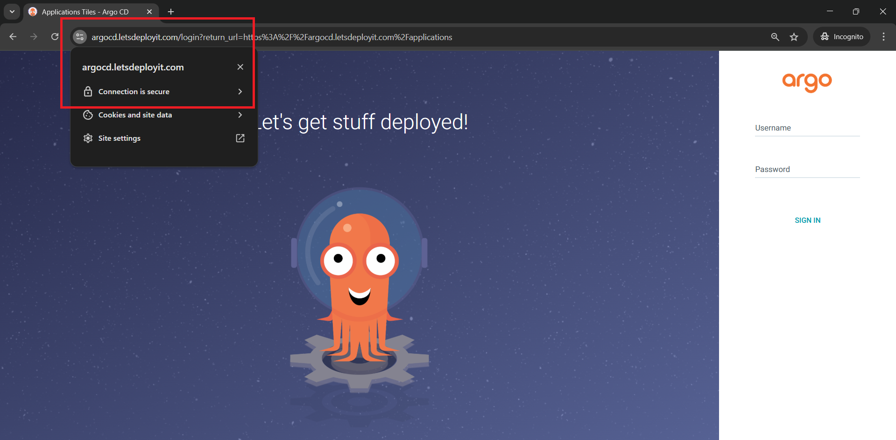
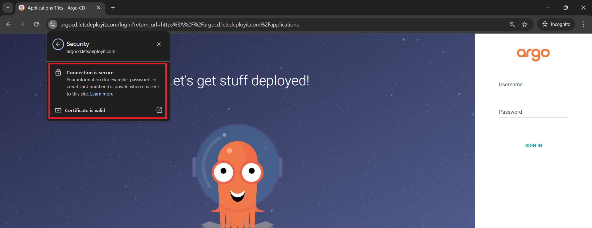
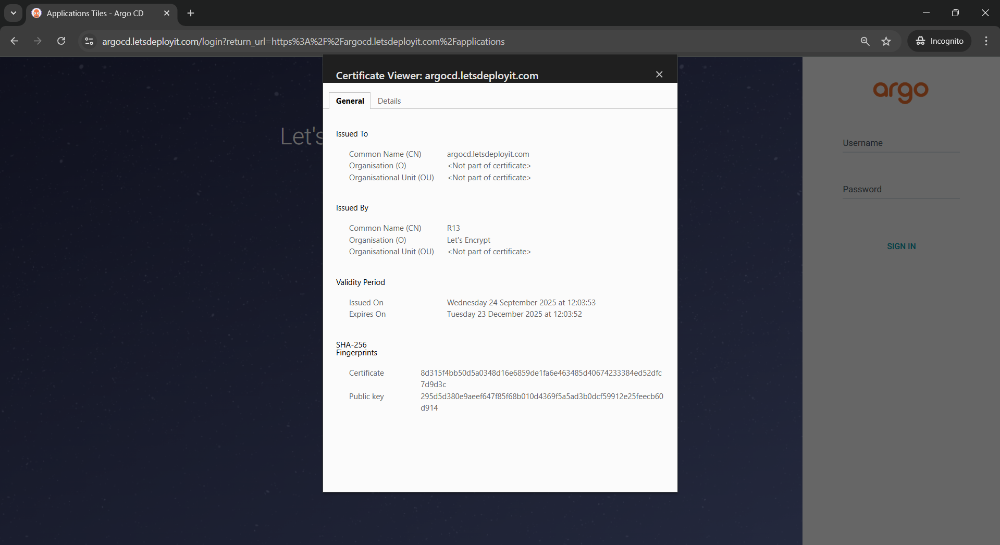
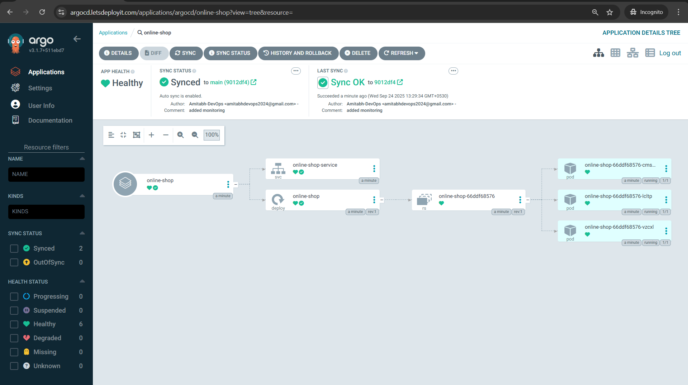

# ArgoCD HTTPS Hosting on EKS

Simple step-by-step guide to set up ArgoCD with HTTPS domain support on AWS EKS using direct `eksctl` commands.

---

## Prerequisites

Before starting, ensure you have:

1. **AWS CLI** installed and configured(with policy of `eks` related, use `admin` for this guide.)

   ```bash
   aws configure
   ```

   

    > Note: You need AWS Access Key ID and Secret Access Key with appropriate permissions to create and manage EKS clusters and related resources.
  
2. **eksctl** installed

   ```bash
   # Linux/WSL
   curl --silent --location "https://github.com/weaveworks/eksctl/releases/latest/download/eksctl_$(uname -s)_amd64.tar.gz" | tar xz -C /tmp
   sudo mv /tmp/eksctl /usr/local/bin
   ```

   Check installation:

   ```bash
   eksctl version
   ```

3. **kubectl** installed

   ```bash
   kubectl version --client
   ```

4. **Helm** installed

   ```bash
   helm version
   ```

   [Install Guide](https://helm.sh/docs/intro/install/)

5. **Domain name** registered.

---

## Step-by-Step Setup

### Step 1: Create EKS Cluster

```bash
# Create EKS Cluster without node group
eksctl create cluster --name argocd-cluster --region eu-west-1 --without-nodegroup
```

### Step 2: Verify Cluster Creation

```bash
eksctl get clusters --region eu-west-1
```


### Step 3: Associate IAM OIDC Provider

```bash
eksctl utils associate-iam-oidc-provider --region=eu-west-1 --cluster=argocd-cluster --approve
```

### Step 4: Create Node Group

```bash
eksctl create nodegroup \
--cluster=argocd-cluster \
--region=eu-west-1 \
--name=argocd-ng \
--node-type=t3.medium \
--nodes=2 \
--nodes-min=1 \
--nodes-max=3 \
--node-volume-size=20 \
--managed
```

### Step 5: Verify Cluster Access

1. Update kubeconfig

    ```bash
    aws eks update-kubeconfig --region eu-west-1 --name argocd-cluster
    ```

2. Verify nodes

    ```bash
    kubectl get nodes
    ```

    

    

### Step 6: Install ArgoCD

1. Create namespace

    ```bash
    kubectl create namespace argocd
    ```

2. Install ArgoCD

    ```bash
    kubectl apply -n argocd -f https://raw.githubusercontent.com/argoproj/argo-cd/stable/manifests/install.yaml
    ```

3. Wait for pods to be ready

    ```bash
    kubectl wait --for=condition=ready pod --all -n argocd --timeout=300s
    ```

### Step 7: Install NGINX Ingress Controller

1. Add Helm repository

    ```bash
    helm repo add ingress-nginx https://kubernetes.github.io/ingress-nginx
    helm repo update
    ```

2. Install ingress controller

    ```bash
    helm install my-ingress-nginx ingress-nginx/ingress-nginx \
      --namespace ingress-nginx \
      --create-namespace \
      --set controller.enableSSLPassthrough=true
    ```

### Step 8: Install cert-manager for SSL Certificates

1. Install cert-manager

    ```bash
    kubectl apply -f https://github.com/cert-manager/cert-manager/releases/download/v1.13.0/cert-manager.yaml
    ```

2. Wait for cert-manager to be ready

    ```bash
    kubectl wait --for=condition=ready pod -l app.kubernetes.io/instance=cert-manager -n cert-manager --timeout=300s
    ```

### Step 9: Configure Let's Encrypt and HTTPS

1. Create [letsencrypt-issuer.yaml](letsencrypt-issuer.yaml) with your email (replace `<your-email@example.com>` with your actual email).
2. Apply Let's Encrypt issuer (update email in letsencrypt-issuer.yaml first)

    ```bash
    kubectl apply -f letsencrypt-issuer.yaml
    ```

3. Create [argocd-ingress.yaml](argocd-ingress.yaml) with your domain (replace `argocd.yourdomain.com` with your actual domain).

4. Apply ArgoCD ingress with SSL

    ```bash
    kubectl apply -f argocd-ingress.yaml
    ```

### Step 10: Update DNS and Access ArgoCD

1. Get the load balancer hostname

    ```bash
    # Get the load balancer hostname (External IP)
    kubectl get svc -n ingress-nginx
    ```

    


2. Point your domain `argocd.yourdomain.com` (replace with your actual domain) to this load balancer in DNS of your domain as a CNAME record

    

---

## Verify SSL Certificate Creation

After applying the ingress, cert-manager will automatically request a Let's Encrypt certificate:

1. Check certificate request status

    ```bash
    kubectl get certificate -n argocd
    ```

    

2. Check certificate details

    ```bash
    kubectl describe certificate argocd-server-tls -n argocd
    ```

3. Check cert-manager logs if issues

    ```bash
    kubectl logs -n cert-manager deployment/cert-manager
    ```

4. Verify the secret was created

    ```bash
    kubectl get secret argocd-server-tls -n argocd
    ```

    


The certificate should show `Ready: True` status. If not, check:
- DNS is pointing to the load balancer
- Domain is accessible from the internet
- cert-manager pods are running
- cert-manager logs for errors


> [!NOTE]
>
> It may take a few minutes (around 5-10 minutes) for the SSL certificate to be issued by Let's Encrypt, or getting `Pending` status is normal during this time, it will automatically update to `True` once issued.

---

### Access ArgoCD (after HTTPS setup):

Open your browser in incognito mode (if you tried previously in normal mode or else use another browser if you still getting http) and navigate to `https://argocd.yourdomain.com`.

- Access ArgoCD at `https://argocd.yourdomain.com`

  

  

  

- Username: `admin`
- Password: Use the initial admin secret, then change it

  ```bash
  kubectl -n argocd get secret argocd-initial-admin-secret -o jsonpath="{.data.password}" | base64 -d 
  ```

---

## Try creating applications in ArgoCD

1. Deploy our online-shop (or any other app from `argocd-demos` repo) application that we used in previous examples (you can use path `multicluster/online-shop`).

    

---

## Cleanup

To destroy the cluster and all resources:

```bash
# Delete the entire cluster (this removes everything)
eksctl delete cluster --name argocd-cluster --region eu-west-1
```

This command will:
- 🗑️ Delete all applications and pods
- 🗑️ Remove node groups and EC2 instances  
- 🗑️ Delete VPC, subnets, and networking components
- 🗑️ Remove load balancers and security groups
- ⚡ Complete cleanup in 10-15 minutes

---

Happy Learning!